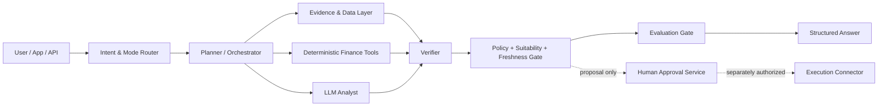

# CherryFin

> **Financial intelligence. Evidence first. Human controlled.**  
> Cherry คือ Financial Agent ที่ไม่ได้แค่ “ตอบเรื่องเงิน” แต่ต้องตรวจสอบที่มา คำนวณซ้ำได้ อธิบายความเสี่ยง และไม่แตะเงินจริงโดยพลการ

CherryFin is a provider-neutral foundation for building a high-assurance financial intelligence agent. It is designed for personal finance, investment research, portfolio risk, business finance, and trading research while keeping numerical work deterministic and financial execution outside the language model.

## Why Cherry is not just a finance chatbot

A convincing answer is not enough in finance. Cherry uses five release conditions:

1. **Evidence** — every current claim points to a supplied, time-stamped evidence ID.
2. **Deterministic math** — monetary and risk calculations run in tested code, not model prose.
3. **Freshness** — prices, filings, news, and balances carry an `as_of` time.
4. **Suitability and uncertainty** — missing context lowers confidence and limits personalization.
5. **Human-controlled action** — the analysis API cannot authorize an order, transfer, or payment.

## Current foundation

- Five operating modes: `personal_cfo`, `investment_research`, `portfolio_risk`, `business_cfo`, and `trading_research`
- OpenAI-compatible model adapter for LM Studio, Ollama, vLLM, SGLang, or a hosted provider
- Strict Pydantic contracts for evidence, calculations, risks, proposed actions, and policy decisions
- Confidence caps for uncited market analysis
- Detection of fabricated evidence IDs and stale market/news evidence
- Deterministic compound-growth, fixed-payment loan, and historical portfolio-risk calculators
- Transaction and credential guardrails
- Per-answer quality gate and regression tests
- FastAPI service, Docker image, and CI workflow

## Architecture



The first pull request implements the solid-line analysis path. Live execution is intentionally absent. See [Architecture](docs/ARCHITECTURE.md) and [Roadmap](docs/ROADMAP.md).

## Quick start

```bash
cp .env.example .env
# Set CHERRYFIN_LLM_MODEL to a model served by your OpenAI-compatible endpoint.
python -m venv .venv
source .venv/bin/activate
python -m pip install -e ".[dev]"
pytest
uvicorn cherryfin.api.main:app --host 0.0.0.0 --port 8080 --reload
```

Example local model settings:

```dotenv
CHERRYFIN_LLM_BASE_URL=http://127.0.0.1:1234/v1
CHERRYFIN_LLM_API_KEY=local
CHERRYFIN_LLM_MODEL=qwen3.5-35b
CHERRYFIN_EXECUTION_ENABLED=false
```

## API examples

Health and capabilities:

```bash
curl http://127.0.0.1:8080/health
curl http://127.0.0.1:8080/v1/capabilities
```

Deterministic loan calculation:

```bash
curl -X POST http://127.0.0.1:8080/v1/calculators/loan \
  -H 'Content-Type: application/json' \
  -d '{
    "principal": "100000",
    "annual_rate_pct": "12",
    "term_months": 12
  }'
```

Evidence-first analysis:

```bash
curl -X POST http://127.0.0.1:8080/v1/analyze \
  -H 'Content-Type: application/json' \
  -d '{
    "query": "Summarize the company result and identify the three largest risks.",
    "mode": "investment_research",
    "evidence": [
      {
        "evidence_id": "filing-2026-q2",
        "kind": "official_filing",
        "source_name": "Company filing repository",
        "title": "Q2 2026 filing",
        "observed_at": "2026-09-01T02:00:00Z",
        "data_as_of": "2026-06-30T23:59:59Z",
        "trust_score": 0.95,
        "excerpt": "Revenue, margins, cash flow, debt, and disclosed risks..."
      }
    ]
  }'
```

The response separates:

- concise findings rather than hidden chain-of-thought;
- assumptions and limitations;
- deterministic calculation traces;
- evidence IDs actually used;
- risk flags and confidence reasons;
- proposed actions and their side-effect class;
- policy and evaluation results.

## Safety contract

CherryFin follows a hard separation of duties:

| Layer | May do | Must not do |
|---|---|---|
| LLM analyst | interpret, compare, explain, propose | execute transactions, invent evidence, handle credentials |
| deterministic tools | calculate using validated inputs | infer missing financial facts |
| policy engine | block, cap, warn, require approval | be overridden by model text |
| approval service | authorize a bounded proposal | create a new proposal silently |
| execution connector | execute one approved idempotent action | broaden amount, asset, account, or expiry |

`CHERRYFIN_EXECUTION_ENABLED=false` is the default. Even when a future execution service is enabled, the analysis endpoint will continue to return `execution_allowed: false`.

## What “best” means for this project

Cherry is not measured by how confidently it predicts markets. It is measured by:

- numerical correctness and reproducibility;
- evidence coverage and citation validity;
- point-in-time data integrity and freshness;
- scenario quality, risk disclosure, and calibration;
- resistance to prompt injection and secret leakage;
- no unauthorized side effects;
- usefulness in Thai and English financial workflows;
- measurable improvement through versioned evaluation sets.

## Development rules

Read [AGENTS.md](AGENTS.md) before changing financial logic. Every change that affects money, risk, evidence, or side effects requires tests. Do not introduce a broker or payment connector into the model process.

```bash
make dev
make test
make lint
```

## Regulatory posture

This repository is an engineering foundation, not a license or legal opinion. Product features such as personalized securities recommendations, digital-asset advice, custody, order routing, or automated execution can trigger different obligations in different jurisdictions. Keep research, advice, approval, and execution as separately reviewable services.

Useful primary references:

- [NIST AI Risk Management Framework: Generative AI Profile](https://www.nist.gov/publications/artificial-intelligence-risk-management-framework-generative-artificial-intelligence)
- [OWASP Prompt Injection guidance](https://genai.owasp.org/llmrisk/llm01-prompt-injection/)
- [FINRA observations on AI agents](https://www.finra.org/media-center/blog/observations-on-ai-agents)
- [Thai SEC intermediary license checker](https://market.sec.or.th/LicenseCheck/views/Intermediaries)

## Status

This is the production-oriented foundation, not yet a complete market-data or banking product. The next milestone is a point-in-time evidence pipeline with official filings, licensed market data, a claims ledger, and benchmarked specialist workflows.
