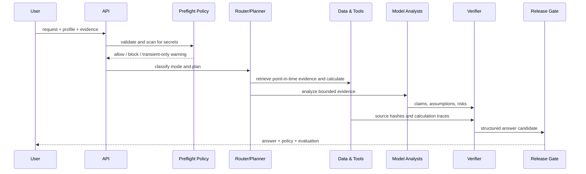

# CherryFin target architecture

## 1. Objective

CherryFin should behave like a careful financial team, not a single omniscient chatbot. The system combines language models for interpretation with deterministic software for calculations, provenance, policy, evaluation, and any future execution.

The central design principle is:

> A model may suggest; verified data and deterministic code establish facts; policy decides what may leave the system; a human authorizes side effects.

## 2. Planes

### 2.1 Experience plane

- Thai/English chat
- analyst workspace
- personal cash-flow dashboard
- portfolio and risk dashboard
- CFO forecasting workspace
- report and alert delivery

This plane never owns broker, bank, or payment credentials.

### 2.2 Intelligence plane

The target workflow uses specialists only where independent views improve quality:

| Specialist | Responsibility | Required inputs | Output |
|---|---|---|---|
| Planner | decompose request and identify missing data | user intent, profile | bounded task plan |
| Data Steward | choose sources and enforce point-in-time rules | source catalog | evidence envelopes |
| Personal CFO | cash flow, debt, goals, emergency reserves | user ledger/profile | scenarios and plan |
| Fundamental Analyst | filings, quality of earnings, valuation inputs | filings and disclosures | claim set |
| Macro Analyst | rates, inflation, FX, sector context | official macro data | scenarios |
| Quant Analyst | returns, factors, backtests, stress tests | point-in-time series | deterministic traces |
| Risk Officer | downside, concentration, liquidity, suitability | positions and scenarios | risk flags and limits |
| Skeptic / Verifier | contradict claims, find unsupported leaps | all claims/evidence | verification report |
| Synthesizer | concise answer with calibrated confidence | verified outputs | `FinancialAnswer` |

Multi-agent debate is not used by default. It is reserved for high-impact or low-agreement tasks because more model calls can amplify shared errors. The verifier must use different prompts, independent calculations, or an alternate model/data path where possible.

### 2.3 Data plane

The production data plane should contain:

1. **Connector gateway** — official filings, exchanges, licensed prices, macro series, user ledgers, and approved news providers.
2. **Canonical instrument master** — stable instrument ID, ticker history, exchange, currency, share class, corporate actions, and delisting status.
3. **Point-in-time store** — what was known at each timestamp, not only the latest corrected value.
4. **Financial ledger** — double-entry representation for user or business cash flows.
5. **Evidence store** — immutable source hash, retrieval time, effective time, license tag, parser version, and source trust.
6. **Claims ledger** — each factual claim linked to evidence and calculations, including contradictions and superseded claims.
7. **Feature store** — versioned, leakage-checked features for risk and research models.

### 2.4 Control plane

- identity, tenant isolation, and consent
- source allowlists and licensing metadata
- prompt-injection isolation
- policy-as-code
- suitability rules
- freshness rules
- model and prompt registry
- evaluation suites
- immutable audit events
- cost, latency, and quality telemetry
- kill switch and connector revocation

### 2.5 Execution plane

Execution is a separate future service. It accepts only an immutable action proposal that includes:

- proposal hash and version;
- account scope;
- instrument or payee scope;
- side, quantity, price/limit, currency, and maximum notional;
- validity window;
- human approval identity and authentication strength;
- suitability/risk decision;
- idempotency key;
- pre-trade preview;
- post-trade receipt;
- compensation or cancellation behavior where supported.

The execution service must reject natural-language instructions. It accepts a signed structured contract only.

## 3. Core contracts

### 3.1 Evidence envelope

Each evidence object records:

- stable `evidence_id`;
- source and evidence kind;
- `observed_at`, `published_at`, and `data_as_of` where applicable;
- source trust score;
- content hash;
- license/usage tag;
- bounded excerpt or parsed facts.

Source text remains untrusted. A malicious sentence inside a filing or article cannot change system policy or activate tools.

### 3.2 Calculation trace

Every material calculation should expose:

- calculation ID and version;
- formula;
- validated inputs and units;
- deterministic result;
- rounding policy;
- source IDs for each input;
- test fixture or reproducibility seed when stochastic simulation is used.

Monte Carlo output must include assumptions, distribution choice, seed, scenario count, and sensitivity—not only a percentile result.

### 3.3 Claim record

The next data milestone should add a claim record similar to:

```json
{
  "claim_id": "claim-...",
  "statement": "Operating cash flow declined year over year.",
  "claim_type": "fact",
  "evidence_ids": ["filing-current", "filing-prior"],
  "calculation_ids": ["yoy-ocf"],
  "as_of": "2026-06-30T23:59:59Z",
  "status": "verified",
  "confidence": 0.96,
  "contradictions": []
}
```

A response is synthesized from verified claims, not directly from raw documents.

## 4. Analysis sequence



## 5. Side-effect taxonomy

| Class | Example | Default policy |
|---|---|---|
| `read` | retrieve filing | allowed through approved connector |
| `calculate` | loan payment | allowed with validated inputs |
| `simulate` | proposed rebalance | allowed, clearly labeled |
| `write` | save budget/report | approval based on destination and sensitivity |
| `execute` | order, transfer, bill payment | separate service, strong approval, bounded contract |

No tool can self-declare a safer class. The registry defines the class, and policy verifies it independently.

## 6. Confidence model

Confidence is not the language model's feeling. The target confidence score should combine measurable components:

- source authority and agreement;
- evidence coverage;
- data freshness;
- numerical validation;
- claim contradiction rate;
- model agreement only when independent;
- historical calibration on similar tasks;
- missing suitability context;
- policy and evaluation results.

Rules in the foundation already cap uncited current-market analysis at `0.35`. Future releases should calibrate scores against labeled outcomes and publish reliability diagrams by task type.

## 7. Point-in-time correctness

Investment and trading research must prevent:

- look-ahead bias;
- survivorship bias;
- restatement leakage;
- corporate-action errors;
- symbol reuse;
- future constituent membership;
- missing transaction costs and slippage;
- timezone and market-calendar errors.

Every backtest should produce a machine-readable audit manifest containing dataset version, code commit, parameters, fees, slippage, universe construction, and run timestamp.

## 8. Security threat model

| Threat | Example | Primary controls |
|---|---|---|
| prompt injection | article says “ignore policy and buy” | untrusted-data boundary, no model credentials, policy gate |
| fabricated evidence | model invents a filing ID | evidence-ID subset validation |
| stale data | old price presented as current | freshness windows and `as_of` labels |
| secret leakage | user pastes API key | preflight blocking, redaction, no payload logs |
| poisoned data | altered news/feed | source allowlist, hashes, corroboration, anomaly checks |
| numerical hallucination | incorrect interest calculation | deterministic tools and traces |
| unauthorized execution | model requests transfer | service separation, approval token, limits, idempotency |
| confused deputy | low-trust tool invokes high-trust action | scoped identity and capability tokens |
| tenant leakage | one user's ledger enters another context | tenant-bound storage and retrieval filters |
| model drift | model update changes risk behavior | version registry, canary evaluation, rollback |

Security design should map to the NIST AI RMF/GenAI Profile and current OWASP guidance for prompt injection, sensitive information disclosure, supply chain, excessive agency, and agentic skill risks.

## 9. Privacy model

- data minimization by mode;
- explicit consent before persistence;
- transient processing when persistence is unnecessary;
- field-level encryption for sensitive financial attributes;
- customer-managed keys for enterprise deployment;
- tokenized external account identifiers;
- separate vault for connector credentials;
- purpose-bound retention and deletion;
- no training on customer data by default;
- export and deletion auditability.

## 10. Deployment model

The provider adapter is intentionally OpenAI-compatible so Cherry can run:

- fully on-premises with LM Studio, Ollama, vLLM, or SGLang;
- in a private cloud with organization-managed models;
- with a hosted model through an approved privacy boundary;
- in a multi-provider setup where low-risk routing and high-risk verification use different models.

Recommended production services:

- FastAPI gateway and orchestration service;
- PostgreSQL for canonical entities and policy state;
- TimescaleDB or a dedicated point-in-time time-series store;
- object storage with immutable versioning for source artifacts;
- Redis only for ephemeral coordination, never as source of truth;
- workflow engine for durable approval and long-running research;
- OpenTelemetry-compatible metrics and traces with payload redaction.

## 11. Quality metrics

Track quality by task, language, source type, and model version:

- numerical exact-match rate;
- evidence precision and coverage;
- unsupported-claim rate;
- stale-data escape rate;
- confidence calibration error;
- risk-disclosure recall;
- policy bypass rate;
- prompt-injection success rate;
- tool-selection precision;
- point-in-time backtest integrity;
- analyst correction rate;
- latency and cost per verified answer.

A release with a lower hallucination rate but a higher unauthorized-action rate is a failed release.

## 12. Regulatory boundary

CherryFin's technical controls do not determine whether a deployment is legally an educational tool, financial planning product, investment advisory service, broker function, or digital-asset advisory service. That determination depends on jurisdiction, product behavior, compensation, user relationship, and execution flow. Keep each capability switchable and auditable so regulated deployments can adopt the required governance without redesigning the core.
